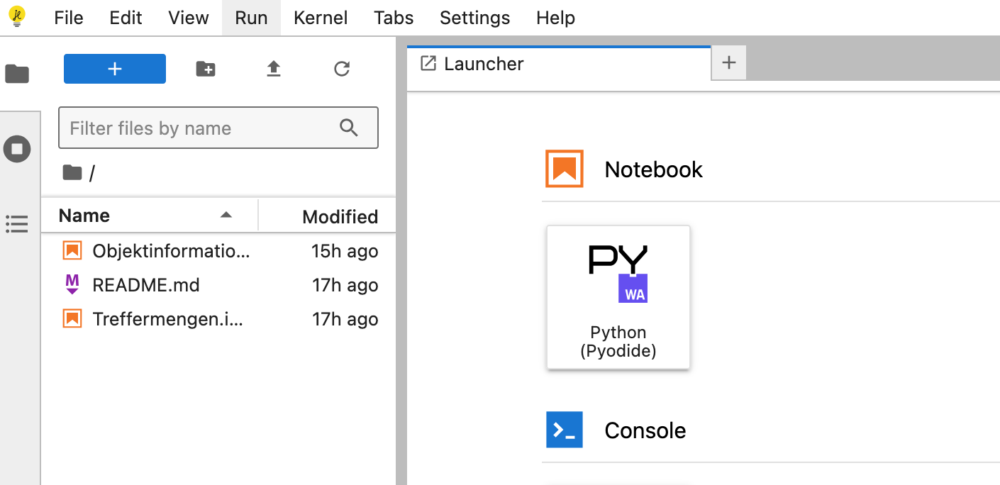
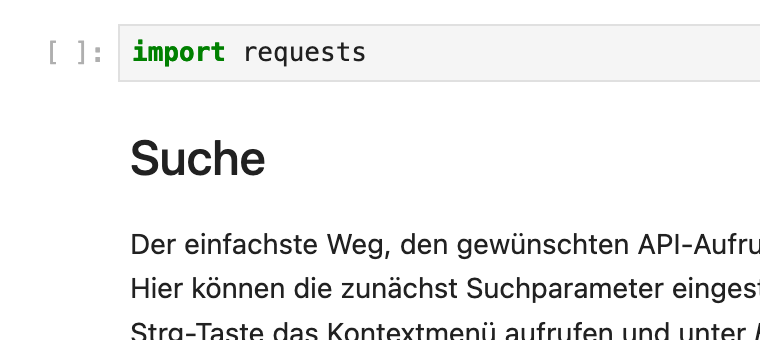

# API-Tutorial für Museum-Digital

## Einführung

Diese Repositorium enthält Codebeispiele zur Nutzung der Museum-Digital-Schnittstelle ([Dokumentation](https://nat.museum-digital.de/swagger)).

Die Jupyter-Notebooks sind dank [JupyterLite](https://jupyterlite.readthedocs.io) interaktiv im Browser ausführbar. Der Link zur Jupyter-Umgebung lautet <https://alexander-winkler.github.io/mdApiTutorial/lab/index.html>. In der Jupyter-Umgebung finden sich in dier linken Spalte alle verfügbaren Notebooks, die mit einem Doppelklick geöffnet werden können.

Die Notebooks sind eine Mischung aus Text uns ausführbarem Code, die jeweils in eigenen Zellen stehen. Ausführbare Code-Zellen erkennt man an den eckigen Klammern links.

Wählt man eine Code-Zelle aus und klickt auf den Play-Button (`▶`) in der oberen Leiste oder drückt Umschalt + Enter (`⇧` + `⏎`), wird der Code ausgeführt.
Falls der Code Output produziert, wird dieser unterhalb der Zelle angezeigt.
Einmal definierte Variablen und Funktion oder aber einmal importierte Bibliotheken bleiben im gesamten Notebook verfügbar, ja die Zellen bauen i.d.R. aufeinander auf.
Es ist daher i.d.R. nötig, die Zellen in der vorgegebenen Reihenfolge sequentiell ausführen.
Die einzelnen Notebooks stehen jedoch für sich, können also voneinander unabhängig ausgeführt werden.

Die Notebooks können auch heruntergeladen und lokal in einer Jupyter-Notebook-Umgebung verwendet werden.

## Die Museum-Digital-Schnittstelle

"museum-digital ist eine Plattform auf der große und kleine Museen Informationen zu ihren Objekten veröffentlichen" (https://www.museum-digital.de/) und wir von mittlerweile fast 1000 Einrichtungen zur Online-Präsentation ihrer Sammlungen oder gar zur kompletten Sammlungsverwaltung eingesetzt.
Das System zeichnet sich durch eine große strukturelle Offenheit aus.
Die Daten werden nicht nür über die Web-Oberfläche ausgespielt, sondern sind bequem auch programmatisch per Schnittstelle abrufbar.

Einige Anwendung bauen auf diesen Schnittstellen auf. Eine Übersicht bietet [diese Seite](https://de.handbook.museum-digital.info/misc/API-basierte-Anwendungen.html).

## Intention und Zielgruppe dieses Tutorials

In diesem Tutorial geht es vorrangig um den Datenabruf. Es richtet sich allgemein an Nachnutzende oder Forschende, die mit den GLAM-Daten arbeiten möchten.
Auch GLAM-Institutionen selbst können von einem programmatischen Datenzugriff profitieren, um bspw. die Daten auf Konsistenz und Lücken.

Ausgeklammert ist aktuell die - ebenfalls über Schnittstelle mögliche - Sammlungsverwaltung aus museum-digital.

Diese Notebooks setzen Grundkenntnisse im Umgang mit Python voraus.

## Übersicht über Notebooks

| Dateiname | Link zum Notebook | interaktiv ausführbare Version | Inhalt |
|:---|:--|:--|:----|
| `Objektinformationen_JSON.ipynb` | [Objektinformationen_JSON.ipynb](content/Objektinformationen_JSON.ipynb) | [JupyterLite](https://alexander-winkler.github.io/mdApiTutorial/lab/index.html?path=Objektinformationen_JSON.ipynb) | Abruf von Metadaten zu einzelnen Objekten im JSON-Format | 
| `Treffermengen.ipynb` | [Objektinformationen_JSON.ipynb](content/Treffermengen.ipynb) | [JupyterLite](https://alexander-winkler.github.io/mdApiTutorial/lab/index.html?path=Treffermengen.ipynb) | Abruf größerer Treffermengen (per Iteration), Erstellen eines Dumps, Statistiken |
| `Mastodon_Bot.ipynb` | [Mastodon_Bot.ipynb](content/Mastodon_Bot.ipynb) | [JupyterLite](https://alexander-winkler.github.io/mdApiTutorial/lab/index.html?path=Mastodon_Bot.ipynb) | Erstellen eines Mastodon-Bots mit [Autodone](https://autodone.idh.uni-koeln.de/) |
